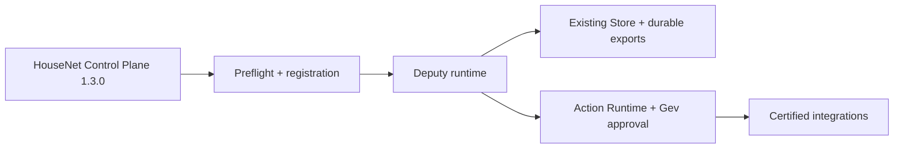

# Command-center · Deputy

## English

**Command-center** is Gev’s operational workspace for Sales & Operations, managed by **Deputy — AI Chief of Staff for Sales & Operations**.

This private Class A HouseNet repository preserves the complete legacy history and provides the governed home for the existing Deputy runtime. The migration wraps the working architecture; it does not replace the Store, Action Runtime, approval boundary, Skill System, integrations, or recovery model.

### Current status

| Surface | State |
|---|---|
| Migration | `MIGRATED` · certification pending |
| Control Plane | HouseNet policy `1.3.0` |
| History | Full history preserved from `d49d60bdff468b662d88d21e00458ce59646a5ca` |
| Data boundaries | Core/internal, business/confidential, credentials/restricted |
| Runtime | Existing Python/Windows/WSL/GPG/Git LFS assumptions preserved |
| Canonical status | Not canonical until certification and owner cutover |

### Start here

- [`house-net-control.json`](house-net-control.json) — immutable repository registration lock.
- [`AGENTS.md`](AGENTS.md) — provider-neutral HouseNet bootstrap map.
- [`CLAUDE.md`](CLAUDE.md) — Claude adapter; preserved Deputy charter is linked from it.
- [`WORKSPACE/`](WORKSPACE/) — operational workspace and live registers.
- [`.claude/`](.claude/) — Deputy runtime, policy, skills, integrations, tests, and durable state.
- [`.secure/README.md`](.secure/README.md) — encrypted recovery design; the recovery key remains outside Git.
- [`legacy README`](.claude/docs/legacy/README-command-center-original.md) — preserved pre-migration landing documentation.

### Governance flow

The Control Plane is the outer governance authority. Local Deputy policy remains the authority for its internal workspace contract. External systems remain authoritative for their own live records. Caches and generated views never become competing truth sources.

### Safety boundary

Secrets, provider credentials, production databases, live provider records, and machine-local recovery keys are not imported into source history. The already-versioned `.secure/credentials.gpg` artifact is preserved unchanged as an opaque encrypted recovery artifact under the approved full-history decision.

## Հայերեն

**Command-center**-ը Գևի Sales & Operations գործառնական աշխատանքային միջավայրն է, որը կառավարվում է **Deputy — Sales & Operations-ի AI Chief of Staff**-ի կողմից։

Այս private Class A HouseNet repository-ն պահպանում է ամբողջ legacy պատմությունը և դառնում է Deputy-ի գործող runtime-ի կառավարվող տունը։ Միգրացիան փաթեթավորում է գործող ճարտարապետությունը և չի փոխարինում Store-ը, Action Runtime-ը, approval սահմանը, Skill System-ը, ինտեգրացիաները կամ recovery մոդելը։

### Ներկա վիճակ

| Մակերես | Վիճակ |
|---|---|
| Միգրացիա | `MIGRATED` · certification-ը սպասվում է |
| Control Plane | HouseNet policy `1.3.0` |
| Պատմություն | Ամբողջ պատմությունը պահպանված է `d49d60bdff468b662d88d21e00458ce59646a5ca`-ից |
| Տվյալների սահմաններ | core/internal, business/confidential, credentials/restricted |
| Runtime | Գործող Python/Windows/WSL/GPG/Git LFS ենթադրությունները պահպանված են |
| Canonical վիճակ | Canonical չէ մինչև certification-ը և owner cutover-ը |

### Որտեղից սկսել

- [`house-net-control.json`](house-net-control.json) — repository-ի immutable registration lock-ը։
- [`AGENTS.md`](AGENTS.md) — HouseNet-ի provider-neutral bootstrap քարտեզը։
- [`CLAUDE.md`](CLAUDE.md) — Claude adapter-ը և պահպանված Deputy charter-ը։
- [`WORKSPACE/`](WORKSPACE/) — գործառնական workspace-ը և live register-ները։
- [`.claude/`](.claude/) — Deputy runtime-ը, policy-ն, skills-ը, integrations-ը, tests-ը և durable state-ը։
- [`.secure/README.md`](.secure/README.md) — գաղտնագրված recovery-ի նկարագրությունը․ բանալին Git-ից դուրս է։

### Անվտանգության սահման

Գաղտնիքները, provider credentials-ը, production database-ները, live provider records-ը և machine-local recovery key-ը source history չեն մտնում։ Արդեն versioned `.secure/credentials.gpg` artifact-ը պահպանվում է անփոփոխ՝ որպես opaque encrypted recovery artifact՝ owner-ի full-history որոշման համաձայն։
